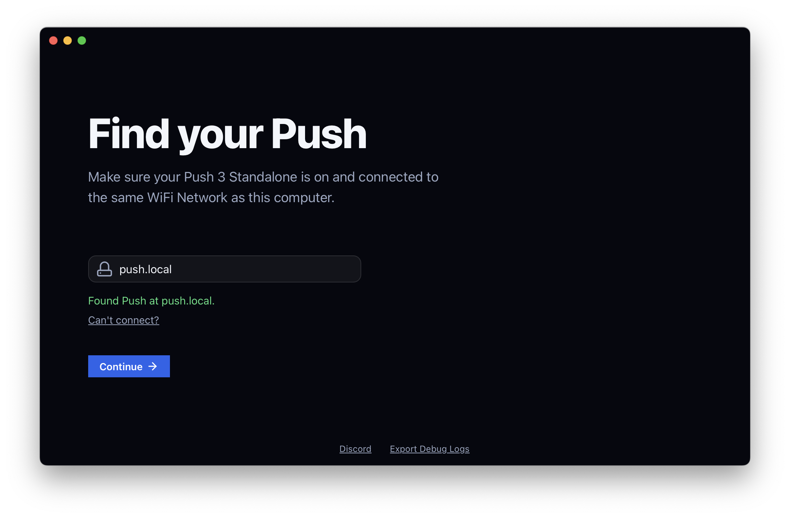

<div align="center">
# Push Hack Installer

**A desktop app that installs [push-hack](https://github.com/federico-pepe/ableton-push-hack) on an your Ableton Push 3 Standalone**.

[**Download**](../../releases)



If you have an Ableton Push 2 or Ableton Push 3 Tethered, see the [push-tethered-app](https://github.com/federico-pepe/push-tethered-app)
</div>

## What it does

The app connects to your Push 3 over SSH and installs the core modules of push-hack: *Push Manager, Push Display, and Push Hack Catalog*. It does the same
job as push-hack's `scripts/install.sh`, but with a guided window instead of
a command line.

## Platforms

Windows, macOS, and Linux. Built with [Wails v3](https://v3alpha.wails.io/).

## Building from source

```bash
cd cmd/installer-ui
wails3 task build
./bin/installer-ui
```

See [docs/build.md](docs/build.md) for requirements and CI plans.

## License

MIT - See [LICENSE](LICENSE)
